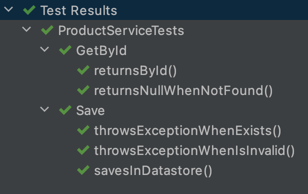

# Few hints on how to write better tests
Original suggestions from [Few hints on how to write better tests by Maciej Walkowiak](https://twitter.com/maciejwalkowiak/status/1549332878525431809)

* Don't use `test` prefix for test methods. This had to be done in JUnit 3 (!) but now it only adds noise. Instead use method names that express the intent.
 
* Group related tests together with JUnit 5
  `@Nested` annotation. This will add structure and save you from repetition
 

* Use `AssertJ`. `JUnit` assertions are not bad but AssertJ will make your tests much cleaner and easier to maintain https://assertj.github.io/doc/
 
 
* Structure tests in `given-when-then` format (or `arrange-act-assert`). Especially make sure that assert part actually takes place. Tests that do not verify the outcome are harmful as they create impression that the code is tested when it's actually not.
* Don't overuse Mocks. When your application is mainly gluing together different technologies and very little logic, perhaps it's better to write integration test instead.
* Don't overuse Mocks especially when you use JPA. When mocking JPA repositories, it's very simple to create good looking tests that pass, but in production the application will behave completely differently. Be careful.
* Use code coverage tools to ensure that you did not miss anything. Code coverage is not meant to tell how much of your code is tested but rather which parts are for sure untested. Run your tests with coverage in
`Intellijidea`
* Use `TDD` as alternative to Code Coverage verification - this way you can be sure that all production code is tested.
* Learn about `Mockito Spies`. You'll find them useful when testing integration with message brokers
* When you have flaky test (test that sometimes succeeds, sometimes fails) and you believe you fixed it, use `@RepeatedTest` from JUnit, with some high number of repetitions to ensure that your fix *really* works.
* When writing `@DataJpaTests`, turn on SQL logging. You'll be surprised that some of your tests do not execute any SQL statements at all. Do not underestimate JPA trickiness.
* "Unit tests were green" type of fuckups are real. Don't rely solely on unit testing or you'll end up in a bad place. Write integration tests, use
  [Test containers](https://www.testcontainers.org/)
  , create few some tests that verify system end to end.

# Testing with JUnit 5 and Spring

See slides: https://www.slideshare.net/Pivotal/testing-with-junit-5-and-spring

Junit 5.7/5.8 features:
* Java Flight Recorder Support
* `@EabledIf`/`@DisabledIf` based on condition methods
* `@Isolated` to run the test in isolation during parallel execution
* `TypedArgumentConverter`
* `@Suite` and annotations `@ConfigurationParameter` 
* `UniqueIdTrackingListener`
* `assertThrowsExactly()`
* `assertInstanceOf()`
* `ClassOrdered` API
* `@TempDir`
* `Named` API

## Examples

* RandomNumberExtension
    ```java
    @Target({ ElementType.FIELD, ElementType.PARAMETER })
    @Retention(RetentionPolicy.RUNTIME)
    @ExtendWith(RandomNumberExtension.class)
    public @interface Random { }
    
    class RandomNumberExtension implements BeforeAllCallback, BeforeEachCallback, ParameterResolver {
      // implement
    }
    
    class RandomNumberTests {
      @Random 
      private int randomNumber;
      
      @BeforeEach beforeEach(@Random int randomNumberInBefore) { }
      
      @Test
      void test(@Random int randomNumberInTest) { }
      
    }
    ```

* ApplicationEvents
    ```java
   @RecordApplicationEvents
   @AllArgConstructor
    class ServiceTests {
      private final Service service;
      private final ApplicationEvents events;
      
      @Test
      void testCall() {
        //invoke service that publishes ServiceEvent 
        service.call(new Message());
        // verify the event was published
        assertThat(events.strema(ServiceEvent.class)).hasSize(1);
      }
    }
    ```